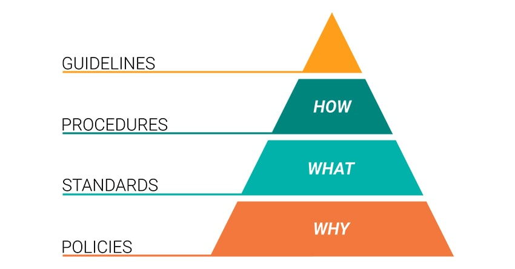

# _How can the business network be secured?_

## 1. Secure and harden network intermediate devices.

Change default settings before deploying on **production network**.

Update firmware to the latest update before deploying the device into the production network.

Remove all non-essential services and programs. Close all unused ports.

Implement "Least Privilege" on user accounts and limit the users.

Enable Logging and auditing. Running activity reports of the devices to detect unusual activities. Eg: failed login attempts.

Ensure that device is configured to use Secure Protocols. SSH rather than telnet connections.

## 2. Secure network perimeter and internal network communication.

- Use VLAN techniques segregate the internal network.
- Have a DMZ network to place the web server or other services accessed by outsiders.
- Micro segment the network in datacenter.
- Implement a firewall to control traffic among networks.
- Implement IPS / IDS to detect and block malicious traffic at the perimeter.

## 3. Limit the number of IPs assigned by DHCP or disable the feature entirely.

4.  **Encrypt the DNS queries.**

5.  **Use tunneling services / VPN for connecting within branches and
    remote users working from home.**

6.  **Restrict file sharing from workstation PCs and implement a
    dedicated server to host shared files. Only allow necessary users to
    the file share.**

7.  **Install and regular update Anti-Virus/Anti-Malware software on
    each workstation, including servers.**

8.  **Enhance physical security of the network devices. Place them in
    secure cabinets. Implement access door control to datacenter.**

9.  **Securing Your Wireless Network**

Changing the SSID or Masking it.

Turning On Encryption in the Wireless Access Points. Most preferable is
WPA2.

Changing Encryption Keys/Passwords from the Default Settings.

Implement Radius server to authenticate users in to wireless network.
Using Two Factor or Better Authentication.

Setting up a schedule for changing wireless network name and passwords

10. **Establish a Network Security Maintenance System**

Performing regular backups of the device configuration.

Implement network monitoring tools. Deploy a SIEM tool to correlate all
logs gathered throughout the network.

Acquire services of a SOC.

11. **Perform quarterly IT security audits to identify weak areas of the
    network**

Vulnerability assessment on servers and network devices.

Check for unused or unnecessary applications running in the background
of client PCs and servers, uninstall them.

Review network ports open in servers and client PCs, close all
unnecessary ports.

Review the settings of the firewall including the rule base. Identify
outdated rules which no longer servers and remove them. Inquire about
the new requirements of the network and implement suitable rules or
modify existing rules.

Configuration and signature patch level of Anti-virus/anti-malware
software.

The overall health of servers, software, and applications

Evaluate the Backups by performing restore test.

Review if the network architecture is aligning with business strategy
and security. Perform penetration testing verify controls are effective.

12. **Security awareness sessions**

Make Sure Your Employees Are Aware of Online Risks. Holding Formal
Cybersecurity Training Sessions.

Sending Out Security Updates and Resources.

Actively Testing Your Employees by Creating Fake Phishing Emails.

Implementing IT security policies on Strong Password Guidelines and
acceptable use of internet based resources.

## Reference:

https://tdwi.org/articles/2019/04/23/dwt-all-9-ways-to-make-your-company-network-secure.aspx

https://www.compuquip.com/blog/secure-business-network

https://www.coxblue.com/how-to-secure-your-business-network-a-12-step-guide-to-network-security/

https://www.siteuptime.com/blog/2019/07/17/8-easy-ways-to-secure-your-business-network-with-digital-security/

https://www.computerworld.com/article/2547589/10-tips-to-secure-your-small-business-network.html

http://solidsystemsllc.com/small-business-network-security/

https://securitytoday.com/articles/2019/08/05/10-simple-steps-to-take-right-now-to-secure-your-business-wifi-network.aspx

https://www.cryptomathic.com/news-events/blog/key-management-system-server-and-device-hardening

https://www.cloud24x7.us/works/device-hardening/

